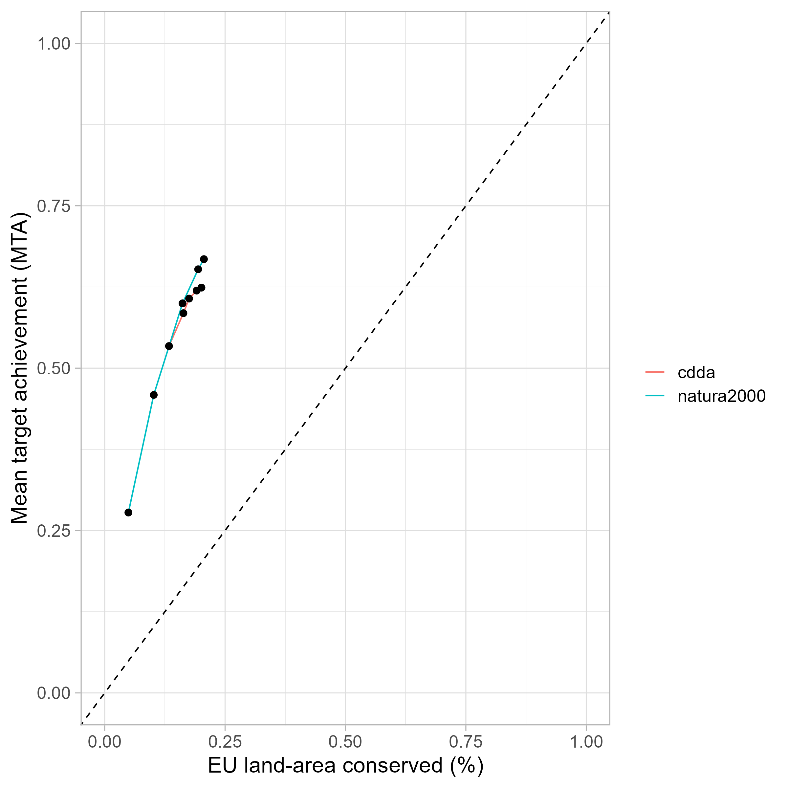

# Mean target achievement (MTA) indicator

<!-- badges: start -->

<!-- badges: end -->

## Content

This repository contains the code and exported indicators for a species-based Mean target achievement (MTA) indicator. Visualized indicators and factsheets can be found on the online dashboard.

*Please note that the code is not reproducible fully given the nature of Art 12 and Art 17 reporting data, which are only publicly available in a form that excludes sensitive species.*

## Acknowledgements

This assessment has been conducted as part of the ETC-BD and the NaturaConnect project. NaturaConnect receives funding under the European Union’s Horizon Europe research and innovation programme under grant agreement number 101060429.

